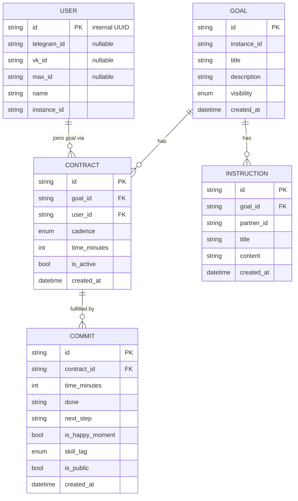
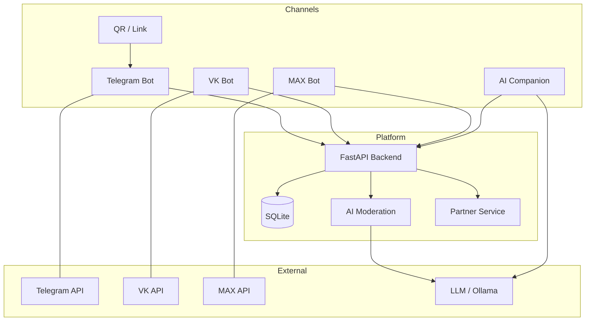
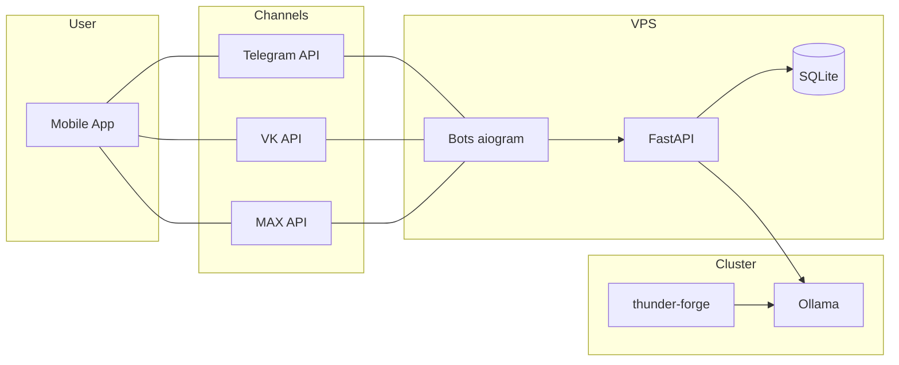

# Shared Goals — Product Requirements Document

> *Design decisions, research notes and changelog are in Russian — reflecting the primary source document: [text.sharedgoals.ru](https://text.sharedgoals.ru)*

**Version:** 1.22 · **Status:** 🟡 In progress · **Language:** English (MVP scope only)

---

## 1. The Problem

People have goals but rarely achieve them alone. Existing tools — task trackers, habit apps, coaching platforms — either create pressure and dependency or isolate the person from others with the same goals.

The core insight from research (Matthews, Dominican University, 2007): people who **write down goals and report progress to others** achieve ~76% of planned results, vs ~43% for those who only think about them. The combination of written commitment + social visibility is what works — not reminders, streaks, or leaderboards.

## 2. The Solution

A platform where:
- You can see that others are moving toward the same goals (without comparing results)
- You fix a time contract with yourself
- Interaction is dissolved into familiar channels — Telegram-first
- No obligation, no manipulative gamification
- AI companions can log time investments on your behalf via the [shared-goals skill](https://github.com/shared-goals/skill)

**The central mechanic:** Goal Contagion. When you see that a person similar to you — same workload, same values — is executing their contract, your own goal activates automatically. Not pressure. Not comparison. Organic motivation.

> *"Happiness ends where Comparison begins."* — Søren Kierkegaard

## 3. Target Audience (MVP)

**One primary persona — a young person at the start of their life journey**

- 16–25 years old, digital-native (Telegram, VK, smartphones as primary interface)
- Searching for their calling — not yet settled in a career or life direction
- Already has digital habits but lacks tools for meaningful time investment
- Responds to social proof: sees others moving → wants to move too
- Does not respond to reminders, pressure, or obligation

**Why this group:**
From the primary source (p2-180, MVP scope): *"For MVP it is sufficient to take one target group — especially important is the audience of young people who are beginning their life journey and finding their calling, but have already formed their habits using digital technologies."*

**How the platform works for this persona:**

1. Sees a QR code or link — joins a goal "Learn programming with friends" or "Run together"
2. Sets a contract: 1 hour per week
3. Sees that 3 others are also active this week → executes own contract
4. Logs a commit: what was done, marks `skill_tag: mind`, optional happy moment flag
5. AI companion (via shared-goals skill) can log time investments automatically

## 4. Core Entities

### 4.1 Goal

A public goal defines the direction. It can be found by anyone; shared goals are non-competitive and humanistic only.

**Visibility:**
- `public` — discoverable in catalog, subject to 4 humanistic criteria
- `invite` — accessible via link only
- `personal` — private, no content restrictions

**4 criteria for public goals** (from the primary source, p2-110):
1. **Noble Curiosity** — no moral-ethical violations in pursuing the goal
2. **Love as vector** — describes your own action, not a requirement of others; no obligation imposed
3. **Human as image** — directed at improving a person or the world
4. **Larger than life** — can be pursued throughout a lifetime (not a one-time event)

### Goal Discovery & Deduplication Flow

When a user enters a goal title, the system proactively helps to avoid fragmentation:

1. **Join existing** — if an identical or very similar goal already exists, the system suggests joining it instead of creating a new one
2. **Geographic / language variant** — if an analogous goal exists in a different region or language, the system suggests creating a linked variant (inherited attributes, different geo-scope)
3. **Child / hierarchical goal** — the system can propose a more specific sub-goal inheriting checks, skill distribution, and other attributes from the parent

Checks, skill distribution, and other attributes can be inherited from the parent/analogous goal, significantly lowering the creation barrier for new participants.

[source](https://text.sharedgoals.ru/p2-180-sharedgoals/#entity_goal)

---

### 4.2 Contract

A time commitment you make with yourself. The essence: "I am ready to invest N minutes per week/month."

- Cadence: `daily / weekly / monthly / occasionally`
- `time_minutes` — optional; default from contract if not specified
- Can be reduced mid-period ("did 20 min instead of 60 — still counts")
- No reminders generated by default

The act of creating a contract already exercises the **Will** skill.

### 4.3 Commit (Execution)

When you consider a contract fulfilled — log it.

**Fields:**
- `time_minutes` — actual time invested (defaults to contract value)
- `done` — what was done (free text)
- `next_step` — optional; auto-filled from previous commit's `next_step`
- `is_happy_moment: bool` — was this an overcoming that brought joy?
- `skill_tag: Optional[Enum]` — which skill area was exercised: `will / mind / feeling / faith`
- `is_public: bool = False` — anonymous by default
- `photo`, `location`, `with_whom` — optional

The AI companion (connected to wearables) can detect emotional tone rise and auto-flag `is_happy_moment`.

### 4.4 Action Plan (Instructions)

Expert-authored instructions for a goal. Required for MVP — at least one partner service must provide instructions for the target goal type.

**Monetization point:** Experts and partner franchises do not reveal their full know-how — they provide a general overview of the path toward the goal and focus on concrete current-moment recommendations. Instructions are generated on the partner's side, on demand, taking into account the participant's profile. This reduces cognitive load on the participant and protects the partner's IP.

Participants get clear next steps; experts get visibility and can offer paid services at specific steps.

Instructions that generate more happy moments in execution → highlighted as successful recommendations for experts. ([source](https://text.sharedgoals.ru/p2-180-sharedgoals/#entity_instruction))

---

## 5. Diagrams

### 5.1 Logical — Entities & Relationships

### 5.2 Component — System Architecture

### 5.3 Physical — Infrastructure (MVP)

---

## 6. MVP Functional Requirements

**MVP scope (from primary source, p2-180, commits 94e12c0, c53f1d2, a613a87):**
1. MVP participant already has an AI companion — to eliminate routine time-logging
2. shared-goals skill implemented: find goals, join via contract, report execution
3. One target group + one goal type — defined by the MVP Partner
4. Partner service implemented — provides Instructions for that goal type
5. Target audience: young people at the start of their life journey, finding their calling, digital-native

> **Critical pre-MVP step:** Selecting the specific MVP Partner is a prerequisite before development starts. The Partner defines the target audience and goal type. Without a confirmed Partner, MVP cannot launch. ([source](https://text.sharedgoals.ru/p2-180-sharedgoals/#mvp))

### Users
- Registration via any supported channel: Telegram (`telegram_id`), VK (`vk_id`), MAX (`max_id`)
- Internal `user.id` (UUID) — channel identifiers are nullable attributes
- No roles, no profiles, no avatars

### Goals
- Create a goal (title, description, visibility)
- Find public goals (list + text search)
- Share goal (link / QR)
- AI auto-check on public goal creation (4 humanistic criteria — openly published)
- Dispute mechanism: comment with mandatory explanation of violation → re-check
- Goal creator can pre-define extended acceptance criteria (CI-style moderation)

### Contracts
- Join a goal → create contract (cadence + optional time)
- Reduce time mid-period and still execute
- Pause / exit contract

### Commits
- Log: done + optional next step
- Auto-fill `done` from previous `next_step`
- `is_happy_moment` flag
- `skill_tag` (will / mind / feeling / faith)
- Optional: photo, location, with whom

### Instructions (Action Plans)
- At least one partner provides instructions for MVP goal type
- Instructions are step-by-step guidance from an expert/franchise
- Instructions that generate more `is_happy_moment` → highlighted as successful
- Partner can offer paid services at specific steps (monetization)

### Aggregates (anonymous, no personal ranking)
- Social Capital = total minutes invested by all participants
- Happy moment count per goal
- Active participants count (no names)
- Activity freshness: "Someone invested X minutes this week" (if commits in last 7 days)

### Telegram Bot commands
`/start` `/goals` `/new_goal` `/join` `/commit` `/my` `/capital`

---

## 7. Success Metrics (MVP)

| Metric | Description | MVP target |
|---|---|---|
| Social Capital | Total minutes invested across all goals | > 0, growing |
| Contract retention | % of contracts active after 30 days | > 50% |
| Happy moment rate | % of commits with `is_happy_moment = true` | Baseline |
| **Key hypothesis** | Execution rate: goals with ≥2 active participants vs solo | Δ ≥ 15% |

*Key hypothesis*: People who see others executing contracts execute their own more often. Confirmed if group contracts outperform solo by ≥15%.

---

## 8. Anti-goals

- No leaderboards or personal rankings
- No streaks or push reminders (by default)
- No multi-language in MVP
- No competitive goals allowed as public

---

## 9. Architecture decisions

- **Backend:** Python, FastAPI, SQLAlchemy + Alembic
- **DB:** SQLite (MVP) → PostgreSQL
- **Bot framework:** aiogram (async, FSM built-in, active Russian community)
- **Hosting:** Linux VPS, separate from OpenClaw infrastructure
- **Multi-instance:** `instance_id: str = "default"` in Goal model — foundation for future federated instances (government ESIA, bank loyalty, international). No multi-tenancy logic in MVP.
- **AI skill:** post-MVP via MCP protocol. Operations: `find_goals`, `join_goal`, `commit`, `get_summary`

---

## 10. Related documents

| File | Language | Contents |
|---|---|---|
| `BACKLOG.md` | 🇷🇺 Russian | Open questions + active feedback |
| `HISTORY.md` | 🇷🇺 Russian | Closed decisions + version history |
| `RESEARCH.md` | 🇷🇺 Russian | Academic references, analogues, findings |
| `data-model-spec.md` | 🇬🇧/🇷🇺 | Data model specification |

**Primary source:** [text.sharedgoals.ru/p2-180-sharedgoals](https://text.sharedgoals.ru/p2-180-sharedgoals/) (Russian)
