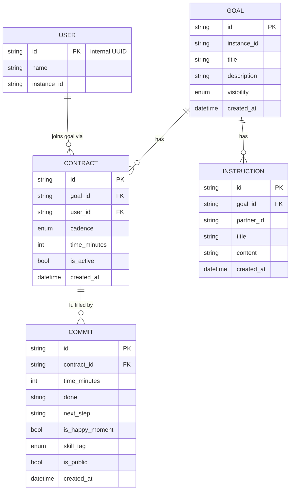
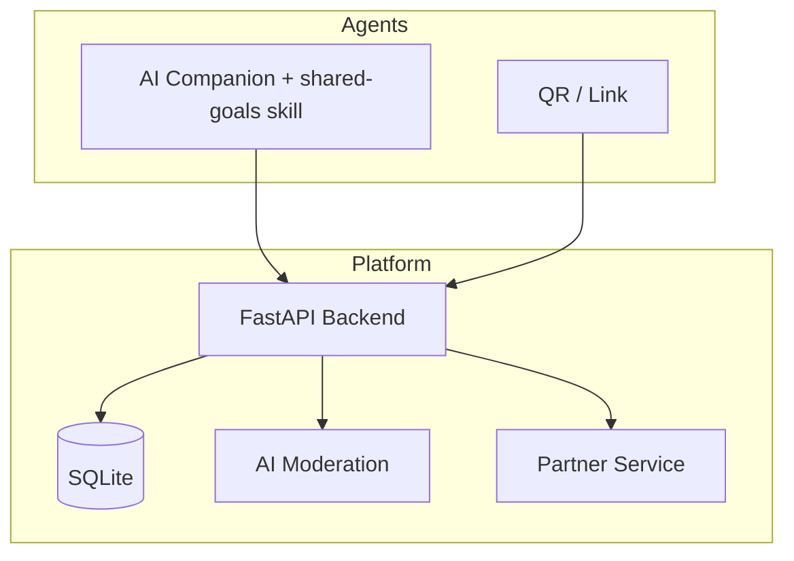
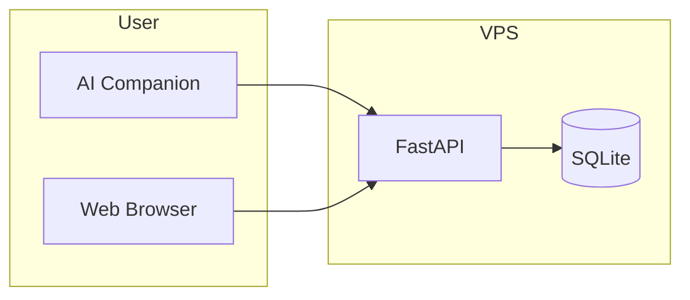

# Shared Goals — Product Requirements Document

> *Design decisions, research notes and changelog are in Russian — reflecting the primary source document: [text.sharedgoals.ru](https://text.sharedgoals.ru)*

**Version:** 1.27 · **Status:** 🟡 In progress · **Language:** English (MVP scope only)

---

## 1. The Problem

People have goals but rarely achieve them alone. Existing tools — task trackers, habit apps, coaching platforms — either create pressure and dependency or isolate the person from others with the same goals.

The core insight from research (Matthews, Dominican University, 2007): people who **write down goals and report progress to others** achieve ~76% of planned results, vs ~43% for those who only think about them. The combination of written commitment + social visibility is what works — not reminders, streaks, or leaderboards.

## 2. The Solution

**Positioning:** Shared Goals is an open platform for social architects and citizens — a model of motivations and development recommendations that multiply joy in people's lives worldwide.

**Main vision:** Shared Goals is an agent-facing platform for collective human development. Humans interact through their own AI companions, equipped with the `shared-goals` skill; the platform gives those agents a shared protocol for creating goals, joining them through personal time contracts, logging real progress, and receiving practical instructions for the next meaningful step.

The first product surface is not a standalone consumer app. It is a service used by agents, including Hermes agents, that can read and write around a person's ordinary text base — Markdown files, Obsidian notes, or another structured workspace — and translate everyday planning into shared goals, commits, and advice loops.

A platform where:
- You can see that others are moving toward the same goals (without comparing results)
- You fix a time contract with yourself
- Interaction is dissolved into any familiar channel — the AI companion handles it
- No obligation, no manipulative gamification
- AI companions can log time investments on your behalf via the [shared-goals skill](https://github.com/shared-goals/skill)
- Shared Goals is itself an **open harness for collective human intelligence** — for growing Social Capital and joy — analogous to how Hermes is an agent platform and paperclip is a platform for AI agent companies

**The central mechanic:** Goal Contagion. When you see that a person similar to you — same workload, same values — is executing their contract, your own goal activates automatically. Not pressure. Not comparison. Organic motivation.

> *"Happiness ends where Comparison begins."* — Søren Kierkegaard

## 3. Target Audience (MVP)

**One primary persona — a young person at the start of their life journey**

- 16–25 years old, digital-native (smartphones as primary interface)
- Searching for their calling — not yet settled in a career or life direction
- Already has digital habits but lacks tools for meaningful time investment
- Responds to social proof: sees others moving → wants to move too
- Does not respond to reminders, pressure, or obligation

**Why this group:**
From the primary source (p2-180, MVP scope): *"For MVP it is sufficient to take one target group — especially important is the audience of young people who are beginning their life journey and finding their calling, but have already formed their habits using digital technologies."*

**How the platform works for this persona:**

1. Sees a QR code or link — joins a goal "Learn programming with friends" or "Run together"
2. Sets a contract: 1 hour per week
3. Sees that 3 others are also active this week → executes own contract
4. Logs a commit: what was done, marks `skill_tag: mind`, optional happy moment flag
5. AI companion (via shared-goals skill) can log time investments automatically

## 4. Core Entities

### 4.1 Goal

A public goal defines the direction. It can be found by anyone; shared goals are non-competitive and humanistic only.

**Visibility:**
- `public` — discoverable in catalog, subject to 4 humanistic criteria
- `invite` — accessible via link only
- `personal` — private, no content restrictions

**4 criteria for public goals** (from the primary source, p2-110):
1. **Noble Curiosity** — no moral-ethical violations in pursuing the goal
2. **Love as vector** — describes your own action, not a requirement of others; no obligation imposed
3. **Human as image** — directed at improving a person or the world
4. **Larger than life** — can be pursued throughout a lifetime (not a one-time event)

### Goal Discovery & Deduplication Flow *(post-MVP v1)*

When a user enters a goal title, the system proactively helps to avoid fragmentation:

1. **Join existing** — if an identical or very similar goal already exists, the system suggests joining it instead of creating a new one
2. **Geographic / language variant** — if an analogous goal exists in a different region or language, the system suggests creating a linked variant (inherited attributes, different geo-scope)
3. **Child / hierarchical goal** — the system can propose a more specific sub-goal inheriting checks, skill distribution, and other attributes from the parent

When existing data is insufficient to find a match, the system can elevate the search to broader categories (e.g. Education, Travel) to suggest existing goals in adjacent areas.

Checks, skill distribution, and other attributes can be inherited from the parent/analogous goal, significantly lowering the creation barrier for new participants.

[source](https://text.sharedgoals.ru/p2-180-sharedgoals/#entity_goal)

---

### 4.2 Contract

A time commitment you make with yourself. The essence: "I am ready to invest N minutes per week/month."

- Cadence: `daily / weekly / monthly / occasionally`
- `time_minutes` — optional; default from contract if not specified
- Can be reduced mid-period ("did 20 min instead of 60 — still counts")
- No reminders generated by default

The act of creating a contract already exercises the **Will** skill.

### 4.3 Commit (Execution)

When you consider a contract fulfilled — log it.

**Fields:**
- `time_minutes` — actual time invested (defaults to contract value)
- `done` — what was done (free text)
- `next_step` — optional; auto-filled from previous commit's `next_step`
- `is_happy_moment: bool` — was this an overcoming that brought joy?
- `skill_tag: Optional[Enum]` — which skill area was exercised: `will / mind / feeling / faith`
- `is_public: bool = False` — anonymous by default
- `photo`, `location`, `with_whom` — optional

The AI companion (connected to wearables) can detect emotional tone rise and auto-flag `is_happy_moment`.

### 4.4 Action Plan (Instructions)

Expert-authored instructions for a goal. Required for MVP — at least one partner service must provide instructions for the target goal type.

**Monetization point:** Experts and partner franchises do not reveal their full know-how — they provide a general overview of the path toward the goal and focus on concrete current-moment recommendations. Instructions are generated on the partner's side, on demand, taking into account the participant's profile. This reduces cognitive load on the participant and protects the partner's IP.

Participants get clear next steps; experts get visibility and can offer paid services at specific steps.

Instructions that generate more happy moments in execution → highlighted as successful recommendations for experts. ([source](https://text.sharedgoals.ru/p2-180-sharedgoals/#entity_instruction))

**Example Partner:** a water activities expert (#vodoplav) who provides Instructions for people wanting to enjoy time on water — suggesting gear, services, routes. ([source](https://text.sharedgoals.ru/p2-155-photo/#vodoplav))

---

## 5. Diagrams

### 5.1 Logical — Entities & Relationships

```mermaid
erDiagram
    USER {
        string id PK "internal UUID"
        string name
        string instance_id
    }
    GOAL {
        string id PK
        string instance_id
        string title
        string description
        enum visibility
        datetime created_at
    }
    CONTRACT {
        string id PK
        string goal_id FK
        string user_id FK
        enum cadence
        int time_minutes
        bool is_active
        datetime created_at
    }
    COMMIT {
        string id PK
        string contract_id FK
        int time_minutes
        string done
        string next_step
        bool is_happy_moment
        enum skill_tag
        bool is_public
        datetime created_at
    }
    INSTRUCTION {
        string id PK
        string goal_id FK
        string partner_id
        string title
        string content
        datetime created_at
    }

    USER ||--o{ CONTRACT : "joins goal via"
    GOAL ||--o{ CONTRACT : "has"
    CONTRACT ||--o{ COMMIT : "fulfilled by"
    GOAL ||--o{ INSTRUCTION : "has"
```

### 5.2 Component — System Architecture

```mermaid
graph TB
    subgraph Agents
        AI[AI Companion + shared-goals skill]
        QR[QR / Link]
    end

    subgraph Platform
        API[FastAPI Backend]
        DB[(SQLite)]
        MOD[AI Moderation]
        PARTNER[Partner Service]
    end

    AI --> API
    QR --> API
    API --> DB
    API --> MOD
    API --> PARTNER
```

### 5.3 Physical — Infrastructure (MVP)

```mermaid
graph LR
    subgraph User
        Agent[AI Companion]
        Browser[Web Browser]
    end

    subgraph VPS
        API[FastAPI]
        DB[(SQLite)]
        API --> DB
    end

    Agent --> API
    Browser --> API
```
---

## 6. MVP Functional Requirements

**MVP scope (from primary source, p2-180, commits 94e12c0, c53f1d2, a613a87, 4eef113, 3a7fea1):**
1. MVP participant already has an AI companion — to eliminate routine time-logging
2. shared-goals skill implemented: find goals, join via contract, report execution
3. One target group + one goal type — defined by the MVP Partner
4. Partner service implemented — provides Instructions for that goal type
5. Target audience: young people at the start of their life journey, finding their calling, digital-native
6. Messenger integrations (Telegram Bot, VK Bot, MAX Bot) — **post-MVP**; interaction via shared-goals skill is sufficient for all versions
7. Web site MVP — view goals and statistics only (no transactional interaction)
8. Goal Discovery — **post-MVP v1**: will be implemented after initial data accumulation in the pilot

> **Critical pre-MVP step:** Selecting the specific MVP Partner is a prerequisite before development starts. The Partner defines the target audience and goal type. Without a confirmed Partner, MVP cannot launch. ([source](https://text.sharedgoals.ru/p2-180-sharedgoals/#mvp))

### Users
- Internal `user.id` (UUID) — no channel identifiers in MVP
- Primary interaction via shared-goals skill (AI companion)
- No roles, no profiles, no avatars

### Goals
- Create a goal (title, description, visibility)
- Find public goals by simple catalog list + text search only; proactive Goal Discovery and deduplication stay post-MVP
- Share goal (link / QR)
- AI auto-check on public goal creation (4 humanistic criteria — openly published)
- Dispute mechanism: comment with mandatory explanation of violation → re-check
- Goal creator can pre-define extended acceptance criteria (CI-style moderation)

### Contracts
- Join a goal → create contract (cadence + optional time)
- Reduce time mid-period and still execute
- Pause / exit contract

### Commits
- Log: done + optional next step
- Auto-fill `done` from previous `next_step`
- `is_happy_moment` flag
- `skill_tag` (will / mind / feeling / faith)
- Optional: photo, location, with whom

### Instructions (Action Plans)
- At least one partner provides instructions for MVP goal type
- Instructions are step-by-step guidance from an expert/franchise
- Instructions that generate more `is_happy_moment` → highlighted as successful
- Partner can offer paid services at specific steps (monetization)

### Aggregates (anonymous, no personal ranking)
- Social Capital = total minutes invested by all participants
- Happy moment count per goal
- Active participants count (no names)
- Activity freshness: "Someone invested X minutes this week" (if commits in last 7 days)

---

## 7. Development Process (TDD-first MVP)

Shared Goals development starts from executable use-case specifications, then implementation. This section is the development contract for starting MVP work.

### Development principles
- **Spec first:** update this PRD before changing product behavior
- **Tests second:** encode the changed use case as an acceptance test before implementation
- **Implementation third:** build the smallest platform behavior that satisfies the test
- **Agent-first:** every MVP workflow must be usable by an agent equipped with the `shared-goals` skill
- **Human text base:** agents may use ordinary Markdown-like files with tags and structure as the working context for goals, commits, and advice
- **PRD upkeep:** the PRD can be updated by the `sg-prd` skill, which reacts to changes in the source Text through a diff-first workflow

### Phased implementation plan
1. **Freeze the MVP contract:** keep the scope centered on agent-mediated human interaction, create/join goals, contract logging, and advice/instruction delivery. Messenger integrations and proactive Goal Discovery stay out of MVP.
2. **Write the TDD acceptance layer:** specify the agent/user use cases before implementation in `ACCEPTANCE.md`: human text-base work, goal creation/joining, contract commits, advice retrieval, and the first partner-driven goal path.
3. **Separate runtime from PRD maintenance:** keep `shared-goals` skill as the model boundary, keep Daily Compass-style scripts as execution boundaries, and let `sg-prd` own diff-first PRD upkeep.
4. **Implement the minimal agent-first flow:** expose only the operations agents need to create or join goals, log progress autonomously, and receive instructions/advice without requiring a human UI.
5. **Add the first partner-driven category:** treat partner goals as real specialized goals with instruction/subscription behavior, not as generic placeholders.
6. **Keep development control simple:** the default Hermes instance is enough for MVP start; a separate Hermes profile can be introduced later.

### Product acceptance lanes
1. **Human text-base flow:** an agent can derive or update goal context from the human's normal Markdown/text workspace without requiring a separate manual UI.
2. **Agent goal flow:** an agent can create a goal or find an existing public goal through simple catalog lookup, then help the human join it through a contract.
3. **Commit flow:** an agent can log progress against an active contract, including time, `done`, optional `next_step`, `skill_tag`, and `is_happy_moment`.
4. **Advice flow:** an agent can ask the platform for instructions or next-step advice for an active contract.
5. **Partner flow:** a partner-driven goal can provide specialized instructions, including subscription-backed advice when applicable.

### Development maintenance lane
- **PRD maintenance flow:** README changes in the source Text can be classified into README, BACKLOG, HISTORY, and RESEARCH updates through the `sg-prd` skill.

---

## 8. Success Metrics (MVP)

| Metric | Description | MVP target |
|---|---|---|
| Social Capital | Total minutes invested across all goals | > 0, growing |
| Contract retention | % of contracts active after 30 days | > 50% |
| Happy moment rate | % of commits with `is_happy_moment = true` | Baseline |
| **Key hypothesis** | Execution rate: goals with ≥2 active participants vs solo | Δ ≥ 15% |

*Key hypothesis*: People who see others executing contracts execute their own more often. Confirmed if group contracts outperform solo by ≥15%.

---

## 9. Anti-goals

- No leaderboards or personal rankings
- No streaks or push reminders (by default)
- No multi-language in MVP
- No competitive goals allowed as public

---

## 10. Architecture decisions

- **Backend:** Python, FastAPI, SQLAlchemy + Alembic
- **DB:** SQLite (MVP) → PostgreSQL
- **Hosting:** Linux VPS, independent from agent runtime infrastructure
- **Multi-instance:** `instance_id: str = "default"` in Goal model — foundation for future federated instances (government ESIA, bank loyalty, international). No multi-tenancy logic in MVP.
- **AI skill:** shared-goals skill for Hermes-compatible agents. Operations: `find_goals`, `join_goal`, `commit`, `get_summary`. Channel-agnostic — works via any AI companion.

## Repositories

| Repo | Description |
|---|---|
| [shared-goals/instance](https://github.com/shared-goals/instance) | Platform instance — FastAPI backend, SQLite, Jinja2 web UI, REST API |
| [shared-goals/robbo-provider](https://github.com/shared-goals/robbo-provider) | Robbo partner provider — personalized instructions service (Computer Club pilot) |
| [shared-goals/skill](https://github.com/shared-goals/skill) | Hermes-compatible skill — AI companion integration |
| [shared-goals/prd](https://github.com/shared-goals/prd) | This document |

---

## 11. Related documents

| File | Language | Contents |
|---|---|---|
| `BACKLOG.md` | 🇷🇺 Russian | Open questions + active feedback |
| `HISTORY.md` | 🇷🇺 Russian | Closed decisions + version history |
| `RESEARCH.md` | 🇷🇺 Russian | Academic references, analogues, findings |
| `ACCEPTANCE.md` | 🇬🇧 English | MVP acceptance scenarios for TDD-first development |
| `data-model-spec.md` | 🇬🇧/🇷🇺 | Data model specification |

**Primary source:** [text.sharedgoals.ru/p2-180-sharedgoals](https://text.sharedgoals.ru/p2-180-sharedgoals/) (Russian)
